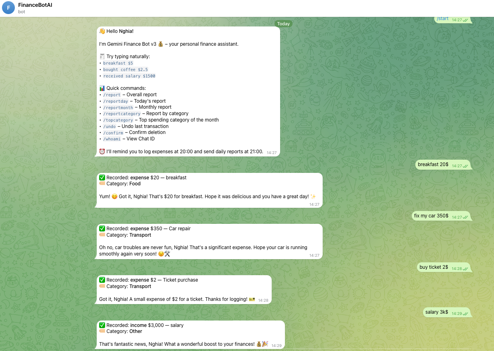
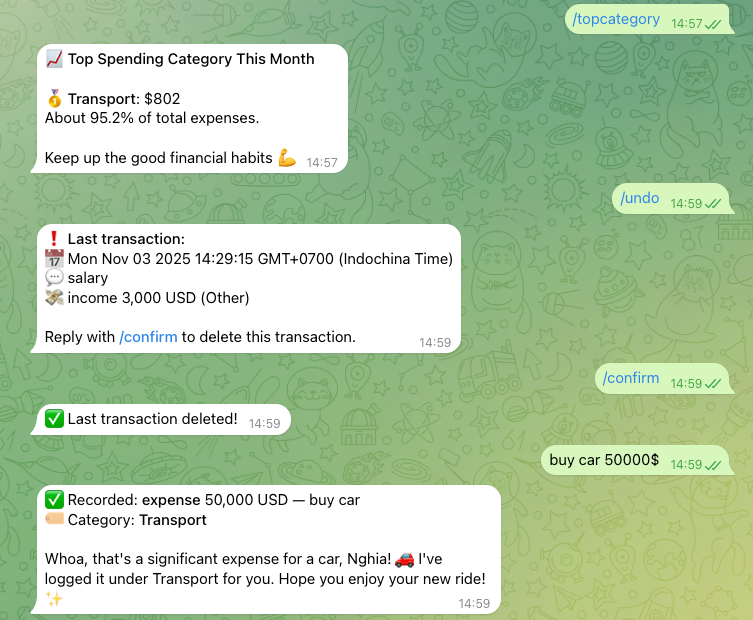
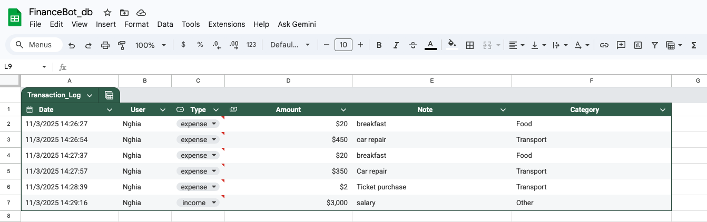

<h1 align="center">💰 Gemini Finance Bot</h1>
<p align="center">
  An <b>AI-powered Telegram bot</b> for personal finance tracking — built with
  <b>Google Apps Script + Gemini API + Google Sheets</b>.<br><br>
  💬 Record your daily expenses naturally → get smart reports & friendly AI feedback.<br>
  💸 <b>100% free, serverless, and open source.</b><br>
  🌍 Runs entirely on Google infrastructure — no hosting or backend required.
</p>

---

## 🌐 Language Versions

| Language | File | Description |
|-----------|------|-------------|
| 🇻🇳 Vietnamese | [src/gemini-bot.vi.gs](src/gemini-bot.vi.gs) | Full Vietnamese version |
| 🌍 English | [src/gemini-bot.en.gs](src/gemini-bot.en.gs) | Full English version |

Each version is a **stand-alone file** — just copy it into Google Apps Script, set your keys, and deploy.  
No external servers, no database setup — everything runs on your Google account.

---

## ✨ Features

| Feature | Description |
|----------|-------------|
| 🤖 Natural text input | Type “bought coffee 35k” or “got salary 10m” — the bot understands it |
| 🧠 AI parsing | Gemini detects type (income/expense), amount, note, and category |
| 🗂️ Auto categorization | Food, Transport, Shopping, Bills, etc. |
| 📊 Instant reports | `/report`, `/reportday`, `/reportmonth`, `/reportcategory`, `/topcategory` |
| ⏰ Daily automation | Reminders at 20:00, daily report at 21:00 |
| 💾 Google Sheets | Secure, exportable, and fully owned by you |
| 💬 AI replies | Friendly, emotional, and human-like feedback |
| 💸 Completely free | Uses only free Google services — no hidden costs |

---

## 🧠 Architecture

```
User → Telegram Bot → Google Apps Script → Gemini API → Google Sheets
```

✅ Fully serverless architecture — everything executes under your Google account.  
No VM, VPS, or paid hosting required.

---

## 📁 Folder Structure

```bash
gemini-finance-bot/
├── README.md
├── LICENSE
├── src/
│   ├── gemini-bot.en.gs
│   └── gemini-bot.vi.gs
├── assets/
│   ├── demo-telegram.png
│   ├── sheet-sample.png
│   └── setup-guide.png
└── .gitignore
```

---

## 🚀 How to Deploy

### 1️⃣ Create a Telegram Bot

1. Open **@BotFather** in Telegram  
2. Send `/newbot` → follow the steps → copy your **BOT_TOKEN**  
3. (Optional) Configure your bot:  

| Command | Purpose |
|----------|----------|
| `/mybots` | List your bots |
| `/deletebot` | Delete a bot |
| `/setdescription` | Set bot description |
| `/setabouttext` | Short “About” info |
| `/setuserpic` | Upload bot profile picture |

---

### 2️⃣ Get Your Chat ID

You’ll need this to send reports or identify users.

1. Send `/start` to your bot  
2. Visit:  
   ```
   https://api.telegram.org/bot<YOUR_BOT_TOKEN>/getUpdates
   ```
3. Look for `"chat":{"id":...}` → that’s your **CHAT_ID**

---

### 2.1 Set Your ADMIN_CHAT_ID

This variable defines **where the bot will send automatic reminders and daily reports**.  
You can use:
- Your **personal Chat ID** (for solo tracking)
- Or a **group Chat ID** (for family/team usage)

In your Apps Script code, find this line:

```js
const ADMIN_CHAT_ID = "YOUR_CHAT_ID";
```

Replace `"YOUR_CHAT_ID"` with your actual Chat ID (the value you found earlier).  
If it’s a group chat, the ID usually starts with a minus sign (e.g. `-5037557217`).

> 🕒 The bot will automatically send:
> - Daily reminder at 20:00 → “It’s time to log your expenses!”
> - Daily summary at 21:00 → your total income & expenses of the day

---

### 3️⃣ Create a Google Sheet

1. Go to [Google Sheets](https://sheets.google.com)  
2. Create a sheet named **Transactions**  
3. Copy the ID from its URL:  
   ```
   https://docs.google.com/spreadsheets/d/<SHEET_ID>/edit
   ```

---

### 4️⃣ Get a Gemini API Key

1. Visit [Google AI Studio](https://aistudio.google.com/app/apikey)  
2. Click **Create API key**  
3. Copy your **GEMINI_KEY**

> ⚠️ Note: Gemini API has a **free quota** — no billing needed for personal use.

---

### 5️⃣ Create a Google Apps Script Project

1. Go to [https://script.google.com](https://script.google.com)  
2. Create a new project → name it `Gemini Finance Bot`  
3. Copy all code from:
   - English → [src/gemini-bot.en.gs](src/gemini-bot.en.gs)
   - Vietnamese → [src/gemini-bot.vi.gs](src/gemini-bot.vi.gs)
4. Replace your credentials:
   ```js
   const BOT_TOKEN  = "YOUR_TELEGRAM_TOKEN";
   const GEMINI_KEY = "YOUR_GEMINI_API_KEY";
   const SHEET_ID   = "YOUR_SHEET_ID";
   const ADMIN_CHAT_ID = "YOUR_CHAT_ID";
   ```

---

### 6️⃣ Deploy as a Web App

1. In **Apps Script**, click **Deploy → New deployment**  
2. Choose **Web App**  
3. Configure:  
   - Execute as → *Me*  
   - Who has access → *Anyone*  
4. Click **Deploy** → Copy your **Web App URL**

---

### 7️⃣ Connect Telegram Webhook

In your browser:

```
https://api.telegram.org/bot<YOUR_BOT_TOKEN>/setWebhook?url=<YOUR_SCRIPT_URL>
```

✅ You should see:
```json
{"ok":true,"result":true,"description":"Webhook was set"}
```

---

## 🔧 Telegram API Cheat Sheet

| Action | URL / Command |
|---------|----------------|
| **Check Webhook Info** | `https://api.telegram.org/bot<TOKEN>/getWebhookInfo` |
| **Delete Webhook** | `https://api.telegram.org/bot<TOKEN>/deleteWebhook` |
| **Get Updates** | `https://api.telegram.org/bot<TOKEN>/getUpdates` |
| **Send Test Message** | `https://api.telegram.org/bot<TOKEN>/sendMessage?chat_id=<ID>&text=Hello` |

---

### 8️⃣ Add Daily Triggers (Reminders & Reports)

In **Apps Script → Triggers (⏰ icon)**, add these:

| Function | Time | Purpose |
|-----------|------|----------|
| `dailyReminderJob` | 20:00 | Daily “log your expenses” reminder |
| `dailyReportJob` | 21:00 | Daily financial summary |

---

## 💬 Example Conversation

> 👤 **User:**  
> bought coffee 35k at Highland  

> 🤖 **Bot:**  
> ✅ Recorded: *expense 35,000₫ — coffee at Highland*  
> ☕ “That’s a nice treat! Enjoy your drink 😋”

---

## 📊 Example Report

```
📅 Daily Report
💰 Income: 10,000,000₫
💸 Expense: 2,750,000₫
🟢 Balance: +7,250,000₫

Nice budgeting today! 🎯
```

---

## 🧰 Tech Stack

| Tool | Purpose |
|------|----------|
| **Google Apps Script** | Serverless backend |
| **Gemini API** | AI natural language understanding |
| **Telegram Bot API** | Chat interface |
| **Google Sheets** | Data storage & reporting |

---

## 📸 Demo & Screenshots

See how Gemini Finance Bot works in action!

<p align="center">
  
  
  <br><em>Interact naturally with the bot — record your expenses or income instantly.</em>
</p>

<p align="center">
  
  <br><em>All transactions are stored in your Google Sheet — organized, filterable, and exportable.</em>
</p>

---

## 💸 Free & Open Source

✅ 100% free to use  
✅ Runs on free-tier Google Apps Script and Gemini API  
✅ No external server or database required  
✅ Open-source under MIT License  

Anyone can fork, customize, or expand this bot with zero hosting costs.

---

## 🧾 License

MIT License © 2025 Nghia Nguyen

---

## 🤝 Contributing

Pull requests are welcome!  
If you find bugs or have ideas → open an **Issue** 🚀  
If you like this project, please give it a ⭐ — it helps others find it!

---

> 💚 *Gemini Finance Bot is 100% free, open-source, and runs entirely on Google Apps Script — no hosting, no fees, no setup hassle.*  
> Made by Nghia Nguyen for the community 🌏
